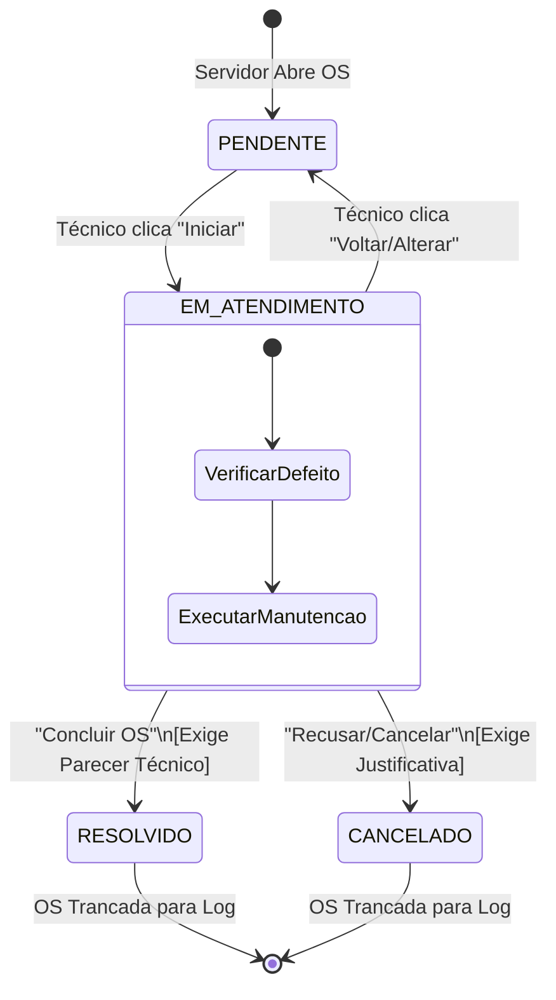
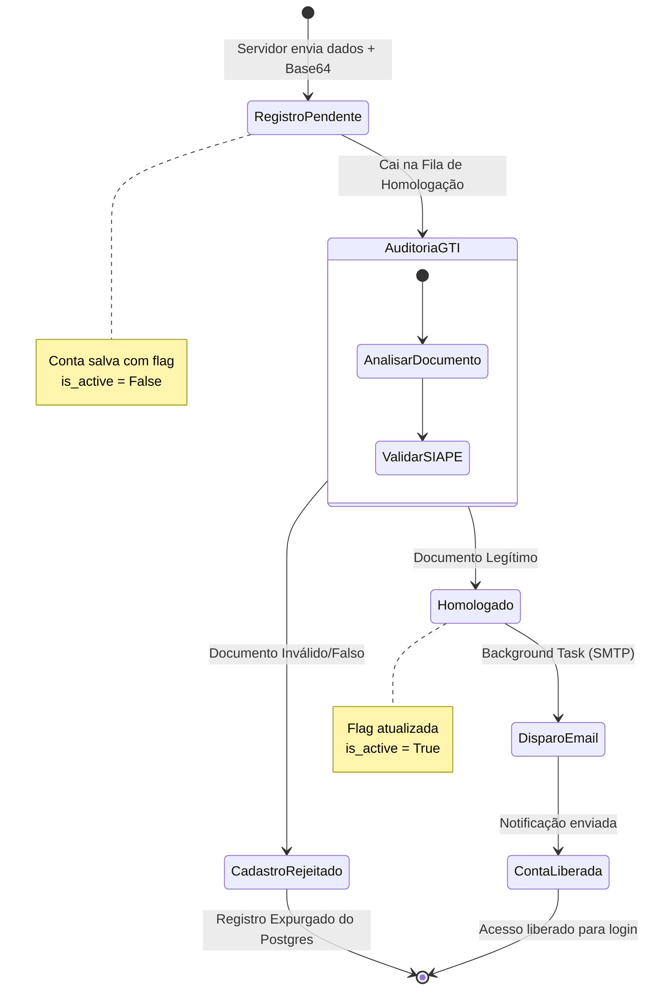
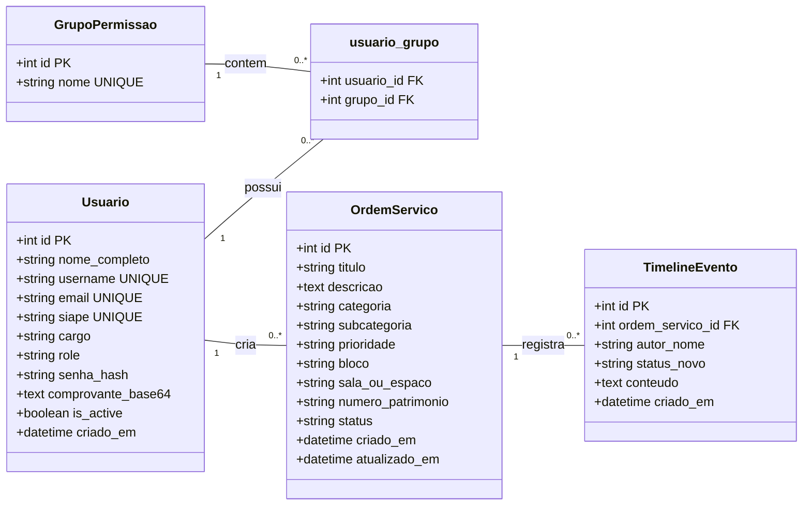
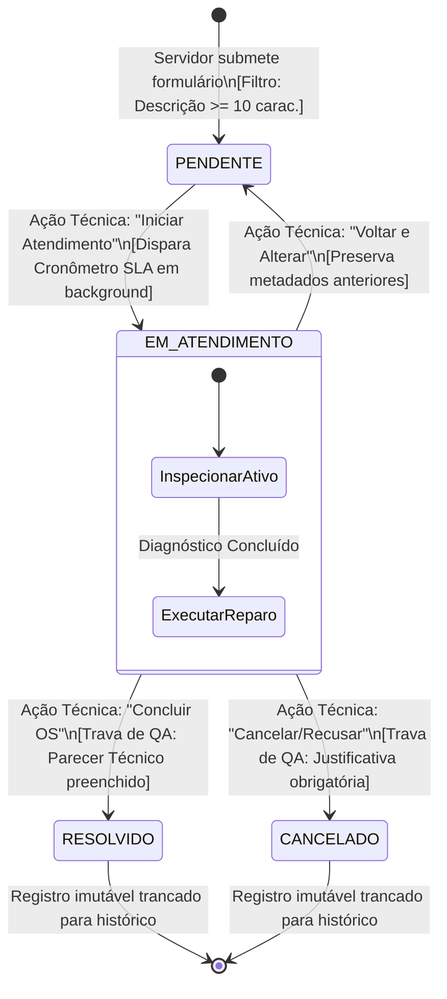
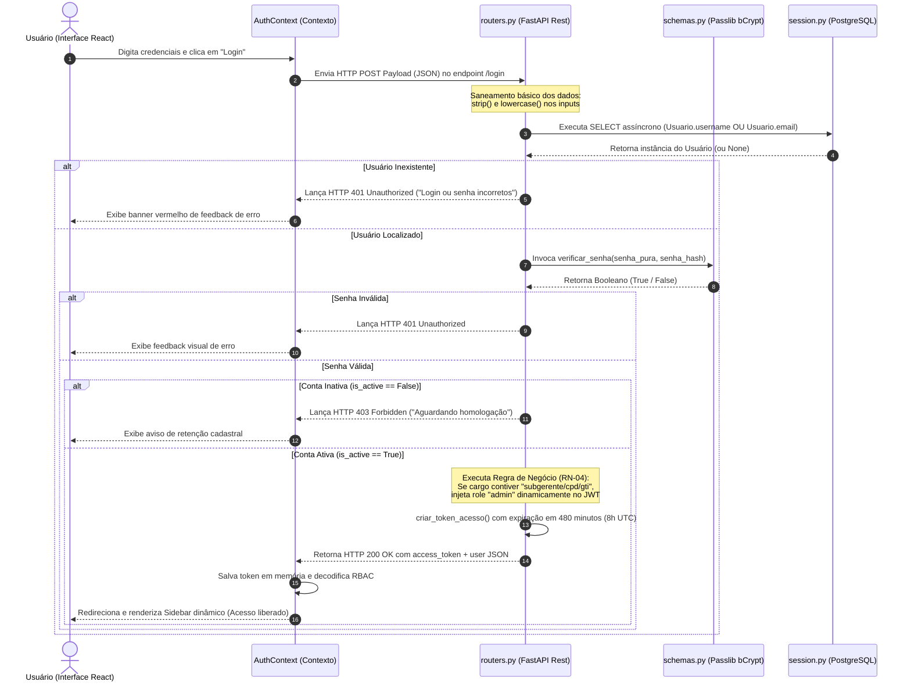
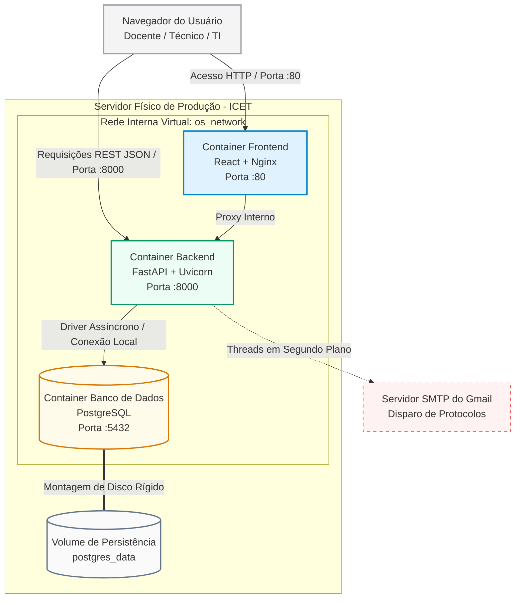

### 📊 Diagrama 1: Transição de Estados da Ordem de Serviço (Ciclo de Vida do Kanban)

Explica visualmente como o chamado caminha pelas colunas e onde as travas de validação descritivas do parecer técnico atuam.

### 📊 Diagrama 2: Ciclo de Vida Cadastral do Usuário (Fila de Homologação de SIAPE)

# 📊 CAPÍTULO II: MODELAGEM ARQUITETURAL E ESTRUTURA DE DADOS (UML)

## 📐 1. Diagrama de Classes de Sistema (Modelo Relacional do PostgreSQL)

Com a migração definitiva para o *PostgreSQL assíncrono*, as entidades foram unificadas em uma arquitetura de tabelas associativas e integridade referencial estrita para evitar registros órfãos ou degradação de performance no barramento. Este diagrama mapeia os tipos de dados reais, chaves primárias (PK), chaves estrangeiras (FK) e a cardinalidade exata do ecossistema.

### *Especificação de Classes e Atributos:*

* **Usuario**: Centraliza o cadastro de todo o corpo funcional do campus (Docentes, TAEs e Gerências). O campo comprovante_base64 armazena o buffer binário convertido em texto, e o campo is_active atua como trava de segurança na triagem cadastral.
* **GrupoPermissao**: Define os papéis de governança (Administradores, Técnicos e Docentes), associando-se aos usuários por uma tabela associativa intermediária (usuario_grupo) para viabilizar o controle de acesso RBAC.
* **OrdemServico**: Representa a abertura física do chamado, amarrada às 6 categorias oficiais da GTI do ICET.
* **TimelineEvento**: A tabela de auditoria cumulativa imutável. Cada ação de alteração de status gera uma linha vinculada à OS, impedindo que o histórico operacional seja burlado.

## 🔄 2. Diagrama de Transição de Estados Avançado (Ciclo Kanban de OS)
O fluxo de trabalho (Workflow) do ecossistema GTI não se resume a mudar palavras em um banco de dados. Ele rege os indicadores de eficiência. Este diagrama detalha as condições físicas e lógicas obrigatórias (como as travas de validação reativa do formulário no frontend e os tratamentos de erro HTTP no backend) que controlam as três colunas do quadro Kanban do painel.

Condições de Transição Mapeadas:
* Fila 1: PENDENTE: Estado nativo de qualquer OS aberta por um servidor. O botão de avanço fica bloqueado se a descrição contiver menos de 10 caracteres.

* Fila 2: EM_ATENDIMENTO: Ativado quando um técnico clica em "Iniciar Atendimento". O sistema calcula a contagem regressiva reativa do SLA em background.

* Fila 3: CONCLUÍDOS / RESOLVIDOS: Estado trancado. Para transitar para RESOLVIDO ou CANCELADO, a regra de negócio obriga o preenchimento do Parecer Técnico de encerramento. Caso contrário, a API executa um rollback transacional.

## ⏱️ 3. Diagrama de Sequência Assíncrona (Fluxo de Autenticação Segura e JWT)
Este é o artefato que comprova a qualidade da engenharia do seu sistema. Ele rastreia detalhadamente o ciclo de vida temporal de uma requisição assíncrona concorrente (async/await). Demonstra como as camadas interagem desde o clique de login na interface, passando pela descriptografia, geração do payload assinado com fuso horário UTC consciente e a retenção do token de 8 horas (480 minutos) casado ao turno regulamentar.

# 🐳 CAPÍTULO III: TOPOLOGIA DE INFRAESTRUTURA E IMPLANTAÇÃO (DOCKER)

## 🖧 1. Diagrama de Contexto e Arquitetura Física de Redes

No ambiente real de produção do campus, o sistema adota o padrão de isolamento absoluto em *Containers Docker*. Este diagrama especifica como as requisições externas entram pelo servidor, como o banco de dados é blindado contra acessos externos e como os volumes locais guardam os dados funcionais.

### *Especificação dos Nós de Infraestrutura:*

1. **Zona Externa (Navegador do Servidor)**: Realiza as chamadas HTTP/JSON.
2. **Container de Frontend (os-frontend)**: Roda sob um servidor HTTP *Nginx* reverso, servindo a build estática compilada do React na porta pública :80.
3. **Container de Backend (os-backend)**: Roda os workers assíncronos do *FastAPI (Uvicorn)* na porta interna :8000. É a única camada que possui acesso lógico às credenciais SMTP do Gmail para as tarefas em segundo plano (Background Tasks).
4. **Container de Banco de Dados (os-database)**: Motor relacional *PostgreSQL* isolado em uma rede virtual interna privada. A porta :5432 não é exposta para o mundo externo, blindando o sistema contra ataques de força bruta.
5. **Volume Físico Persistente (postgres_data)**: Diretório mapeado diretamente no disco rígido do servidor do ICET, garantindo que mesmo se o container for destruído ou reiniciado, nenhuma Ordem de Serviço ou cadastro homologado seja apagado.

## 🗄️ 2. Dicionário de Dados e Restrições de Integridade (Schema PostgreSQL)

Este documento traduz a tipografia de dados do PostgreSQL do mundo real, as chaves de indexação e as regras severas de preenchimento nulo (NOT NULL).

### *Tabela 1: usuarios (Armazenamento Cadastral e Credenciais)*

Mapeia todos os servidores solicitantes e operadores de TI homologados no sistema.

| Nome da Coluna | Tipo de Dado (PostgreSQL) | Restrições / Atributos | Descrição Operacional e Regras de Negócio |
| :--- | :--- | :--- | :--- |
| **id** | SERIAL | PRIMARY KEY, NOT NULL | Identificador incremental autogerado pelo banco de dados. |
| **nome_completo** | VARCHAR(255) | NOT NULL | Nome completo do servidor (Sem abreviações na interface). |
| **username** | VARCHAR(150) | UNIQUE, NOT NULL | Identificador de login (Mapeado em lowercase no backend). |
| **email** | VARCHAR(255) | UNIQUE, NOT NULL | E-mail corporativo institucional. **Trava: Deve conter @ufam.edu.br**. |
| **siape** | VARCHAR(20) | UNIQUE, NOT NULL | Registro funcional do servidor. *Trava: Entre 5 e 12 dígitos numéricos*. |
| **cargo** | VARCHAR(100) | NOT NULL | Cargo. Se contiver "subgerente", "gti" ou "cpd", herda privilégios. |
| **role** | VARCHAR(30) | NOT NULL | Papel base de permissão do sistema (admin, tecnico, servidor). |
| **senha_hash** | VARCHAR(255) | NOT NULL | Hash bCrypt gerado em repouso. *A senha pura nunca é persistida*. |
| **comprovante_base64** | TEXT | NULLABLE | Buffer binário do arquivo comprimido convertido em string de texto. |
| **is_active** | BOOLEAN | DEFAULT FALSE, NOT NULL | Status da conta. Se False, bloqueia login na esteira de validação. |
| **criado_em** | TIMESTAMP | DEFAULT CURRENT_TIMESTAMP | Carimbo de data e hora UTC consciente do registro da solicitação. |

### *Tabela 2: ordens_servico (Registro de Incidentes e Demandas GTI)*

Centraliza o fluxo e o histórico de triagem das OS abertas no campus.

| Nome da Coluna | Tipo de Dado (PostgreSQL) | Restrições / Atributos | Descrição Operacional e Regras de Negócio |
| :--- | :--- | :--- | :--- |
| **id** | SERIAL | PRIMARY KEY, NOT NULL | Código identificador numérico único da Ordem de Serviço. |
| **titulo** | VARCHAR(200) | NOT NULL | Título padronizado gerado automaticamente: [Categoria] Setor - Sala. |
| **descricao** | TEXT | NOT NULL | Detalhamento do defeito. *Trava: Mínimo de 10 caracteres no input*. |
| **categoria** | VARCHAR(100) | NOT NULL | *Enum Restrito:* Deve pertencer a uma das 6 categorias oficiais da GTI. |
| **subcategoria** | VARCHAR(100) | NOT NULL | Mapeamento lógico secundário para retrocompatibilidade relacional. |
| **prioridade** | VARCHAR(20) | DEFAULT 'MEDIA', NOT NULL | Nível de urgência da triagem do chamado (BAIXA, MEDIA, ALTA). |
| **bloco** | VARCHAR(100) | NOT NULL | Identificação do prédio ou bloco físico (Ex: Bloco A, Bloco B, Central). |
| **sala_ou_espaco** | VARCHAR(100) | NOT NULL | Número da sala, laboratório ou departamento requisitante. |
| **numero_patrimonio** | VARCHAR(50) | NULLABLE | Código numérico fixado na etiqueta de patrimônio do ativo, se aplicável. |
| **status** | VARCHAR(30) | NOT NULL | *Enum Restrito:* PENDENTE, EM_ATENDIMENTO, RESOLVIDO, CANCELADO. |
| **criado_em** | TIMESTAMP | DEFAULT CURRENT_TIMESTAMP | Carimbo da hora exata de emissão do chamado para cálculo do SLA. |
| **atualizado_em** | TIMESTAMP | DEFAULT CURRENT_TIMESTAMP | Log temporal da última movimentação operacional registrada na fila. |

### *Tabela 3: timeline_eventos (Logs de Auditoria Imutáveis)*

Guarda o histórico sequencial cumulativo das ações tomadas em cada chamado.

| Nome da Coluna | Tipo de Dado (PostgreSQL) | Restrições / Atributos |  Descrição Operacional e Regras de Negócio |
| :--- | :--- | :--- | :--- |
| **id** | SERIAL | PRIMARY KEY, NOT NULL | Identificador único do log de evento. |
| **ordem_servico_id** | INTEGER | FOREIGN KEY, NOT NULL | Vinculado à tabela ordens_servico. *Ação CASCADE em caso de expurgo*. |
| **autor_nome** | VARCHAR(255) | NOT NULL | Nome completo do operador ou do sistema que executou a movimentação. |
| **status_novo** | VARCHAR(30) | NOT NULL | Cópia do estado para o qual a OS transitou na coluna do Kanban. |
| **conteudo** | TEXT | NOT NULL | Histórico descritivo da ação ou *Parecer Técnico obrigatório de encerramento*. |
| **criado_em** | TIMESTAMP | DEFAULT CURRENT_TIMESTAMP | Carimbo de data e hora do registro da movimentação. |
