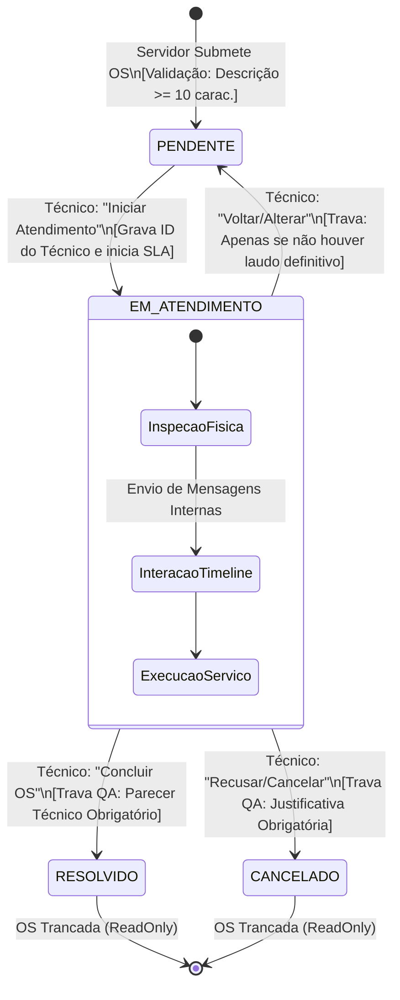
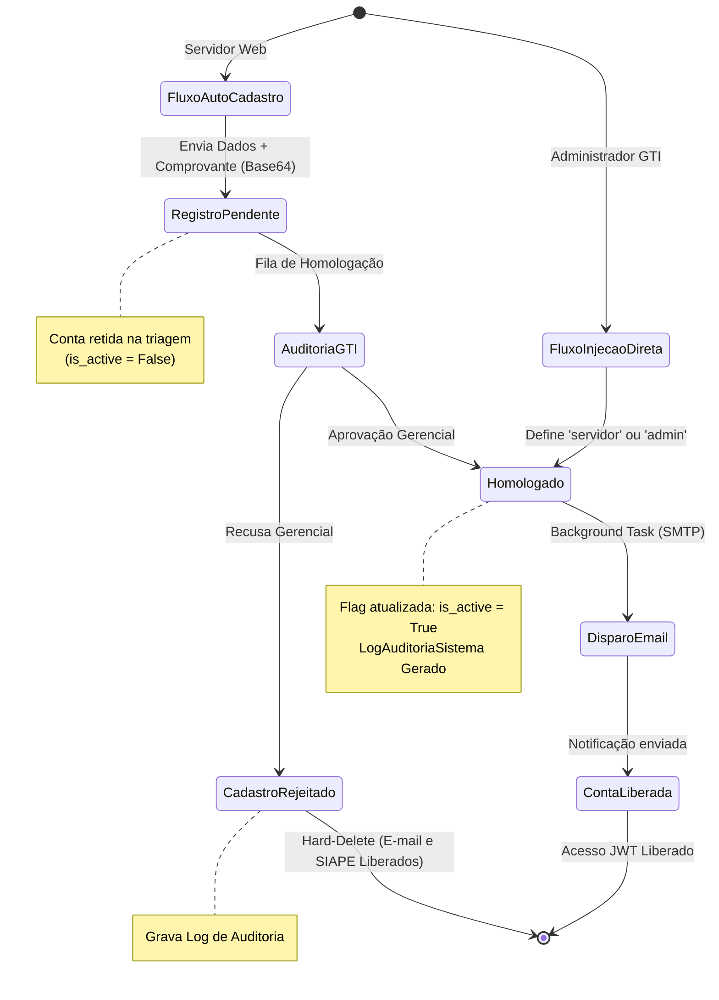
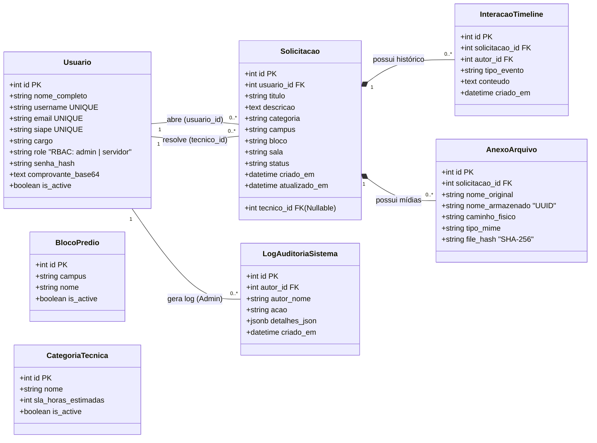
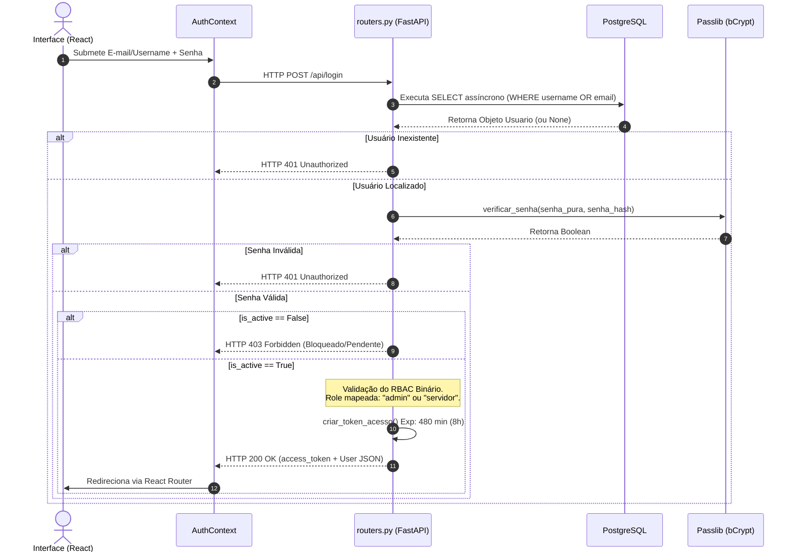

### 📊 5. Diagramas de Transição de Estados (Workflows)

#### 5.1. Ciclo de Vida da Ordem de Serviço (Kanban)

Mapeia o caminho da solicitação pelas colunas e a atuação das travas de validação descritivas e laudos obrigatórios.



#### 5.2. Ciclo de Vida Cadastral e RBAC

Demonstra as duas vias de entrada no sistema: o fluxo de auto-cadastro (com a trava de auditoria e a nova inteligência de **Hard-Delete** para expurgo de recusas) e a injeção direta pela governança.



---

# 📊 CAPÍTULO II: MODELAGEM ARQUITETURAL E ESTRUTURA DE DADOS (UML)

## 📐 1. Diagrama de Classes de Sistema (Modelo Relacional SQLAlchemy)

Com a consolidação do PostgreSQL assíncrono (`asyncpg`), as entidades operam com integridade referencial estrita (`selectinload`). Este diagrama mapeia a cardinalidade exata do ecossistema físico, refletindo as tabelas de Governança Dinâmica e o Motor de Auditoria.



## ⏱️ 2. Diagrama de Sequência Assíncrona (Fluxo de Autenticação Segura e JWT)

Rastreia o ciclo de vida temporal da requisição (async/await), demonstrando o processamento da arquitetura JWT, a validação estrita do RBAC Binário e a geração do payload seguro.



---

# 🐳 CAPÍTULO III: TOPOLOGIA DE INFRAESTRUTURA E IMPLANTAÇÃO (DOCKER)

## 🖧 1. Diagrama de Contexto e Arquitetura Física

Ilustra o isolamento absoluto em Contêineres Docker, demonstrando o bypass do proxy para *Streaming* direto de API (`FileResponse`), mantendo o banco de dados e as pastas físicas blindados contra a rede externa.

```mermaid
graph TD
    subgraph Servidor_Fisico_ICET [Servidor Físico de Produção]
        subgraph Rede_Virtual_Docker [Rede Interna: os_network]
            direction LR
            FRONT[os-frontend<br/>React + Vite/Nginx<br/>Porta :5600 / :80]
            
            BACK[os-backend<br/>FastAPI + Uvicorn<br/>Porta :8000]
            
            DB[(os-database<br/>PostgreSQL<br/>Porta :5432)]
        end
        
        VOL_DB[(Volume Persistente<br/>postgres_data)]
        VOL_MEDIA[(Volume de Mídia<br/>.data/uploads)]
    end

    CLIENT[Navegador do Usuário]

    %% Fluxos de Comunicação
    CLIENT -->|Navegação SPA| FRONT
    CLIENT -->|Streaming GET Mídias (Bypass)| BACK
    FRONT -->|Fetch API (JSON)| BACK
    BACK -->|Asyncpg Driver| DB
    DB ===|Mount DB| VOL_DB
    BACK ===|Mount Imagens| VOL_MEDIA
    BACK -.->|Disparo Background| SMTP[Servidor SMTP Gmail]
    
    style CLIENT fill:#f4f4f5,stroke:#a1a1aa,stroke-width:2px;
    style FRONT fill:#e0f2fe,stroke:#0284c7,stroke-width:2px;
    style BACK fill:#ecfdf5,stroke:#059669,stroke-width:2px;
    style DB fill:#fffbeb,stroke:#d97706,stroke-width:2px;

```

---

## 🗄️ 2. Dicionário de Dados e Restrições de Integridade (Schema PostgreSQL)

### Tabela: `usuarios` (Credenciais e RBAC)

| Coluna | Tipo | Restrições | Regras de Negócio e Comportamento |
| --- | --- | --- | --- |
| **id** | SERIAL | PK | Identificador autogerado pelo banco. |
| **username** | VARCHAR(150) | UNIQUE, NOT NULL | Login primário mapeado em lowercase. |
| **email** | VARCHAR(255) | UNIQUE, NOT NULL | **Trava:** Exige sufixo institucional `@ufam.edu.br`. |
| **siape** | VARCHAR(20) | UNIQUE, NOT NULL | **Trava:** Verificação de 5 a 12 dígitos numéricos. |
| **role** | VARCHAR(30) | NOT NULL | **RBAC Binário:** Classifica como `servidor` ou `admin`. |
| **senha_hash** | VARCHAR(255) | NOT NULL | Criptografia bcrypt. Suporta injeção de flags (ex: `SOFT_DELETED_ACCOUNT`). |
| **is_active** | BOOLEAN | DEFAULT FALSE | Se `False`, bloqueia autenticação. Recusas aplicam *Hard-Delete* expurgando a linha. |

### Tabela: `solicitacoes` (Motor Kanban)

| Coluna | Tipo | Restrições | Regras de Negócio e Comportamento |
| --- | --- | --- | --- |
| **id** | SERIAL | PK | Código sequencial da Ordem de Serviço. |
| **usuario_id** | INTEGER | FK, NOT NULL | Vincula a OS estritamente ao criador original. |
| **tecnico_id** | INTEGER | FK, NULLABLE | Preenchido automaticamente ao assumir `EM_ATENDIMENTO`. |
| **categoria** | VARCHAR(100) | NOT NULL | Herda nomenclatura da tabela `categorias_tecnicas`. |
| **campus / bloco / sala** | VARCHAR | NOT NULL | Entrada geográfica herdada dinamicamente de `blocos_predios`. |
| **status** | VARCHAR(30) | NOT NULL | Trânsito restrito: PENDENTE, EM_ATENDIMENTO, RESOLVIDO, CANCELADO. |

### Tabela: `anexos_arquivos` (Gestão de Evidências Fotográficas)

| Coluna | Tipo | Restrições | Regras de Negócio e Comportamento |
| --- | --- | --- | --- |
| **solicitacao_id** | INTEGER | FK, NOT NULL | Chave vinculada à OS (Configuração Cascade on Delete). |
| **nome_armazenado** | VARCHAR(255) | UNIQUE, NOT NULL | Higienização do arquivo via `UUID v4` + extensão pura (`.jpeg`/`.png`). |
| **file_hash** | VARCHAR(64) | UNIQUE, NOT NULL | Algoritmo `SHA-256`. Aplica bloqueio criptográfico deduzindo arquivos idênticos no volume do servidor. |

### Tabela: `logs_auditoria_sistema` (Trilha de Auditoria - Audit Trail)

| Coluna | Tipo | Restrições | Regras de Negócio e Comportamento |
| --- | --- | --- | --- |
| **autor_id** | INTEGER | FK, NOT NULL | ID do Administrador que executou o comando crítico. |
| **autor_nome** | VARCHAR(255) | NOT NULL | Gravação legível do nome do gestor responsável. |
| **acao** | VARCHAR(100) | NOT NULL | Tag unificada do evento (Ex: `BLOQUEIO_ADMINISTRATIVO_CONTA`). |
| **detalhes_json** | JSONB | NOT NULL | Payload serializado da ação efetuada (Prova de auditoria irrefutável). |

### Tabelas de Dinamismo Institucional

* **`blocos_predios`:** (campus, nome, is_active). Alimenta os selects geográficos do Frontend dinamicamente, permitindo a gestão do mapa de infraestrutura sem deploys novos.
* **`categorias_tecnicas`:** (nome, sla_horas_estimadas, is_active). Acordo de Nível de Serviço. Define os cálculos matemáticos autônomos de urgência e SLA na fila operacional.
