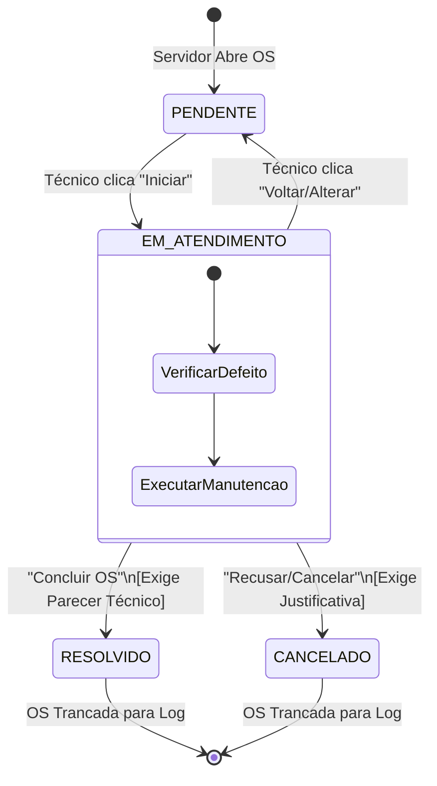

### 📊 Diagrama 1: Transição de Estados da Ordem de Serviço (Ciclo de Vida do Kanban)

Explica visualmente como o chamado caminha pelas colunas e onde as travas de validação descritivas do parecer técnico atuam.



### 📊 Diagrama 2: Ciclo de Vida Cadastral do Usuário (Fila de Homologação de SIAPE)

```mermaid

stateDiagram-v2
    [*] --> RegistroPendente : Servidor envia dados + Base64
    note right of RegistroPendente
        Conta salva com flag
        is_active = False
    end note
    
    RegistroPendente --> AuditoriaGTI : Cai na Fila de Homologação
    
    state AuditoriaGTI {
        [*] --> AnalisarDocumento
        AnalisarDocumento --> ValidarSIAPE
    }
    
    AuditoriaGTI --> CadastroRejeitado : Documento Inválido/Falso
    CadastroRejeitado --> [*] : Registro Expurgado do Postgres
    
    AuditoriaGTI --> Homologado : Documento Legítimo
    note right of Homologado
        Flag atualizada
        is_active = True
    end note
    
    Homologado --> DisparoEmail : Background Task (SMTP)
    DisparoEmail --> ContaLiberada : Notificação enviada
    ContaLiberada --> [*] : Acesso liberado para login
